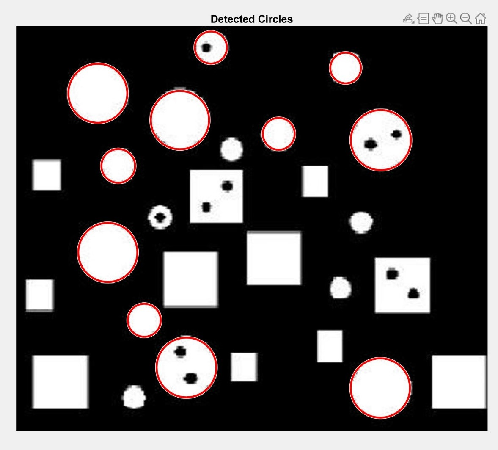
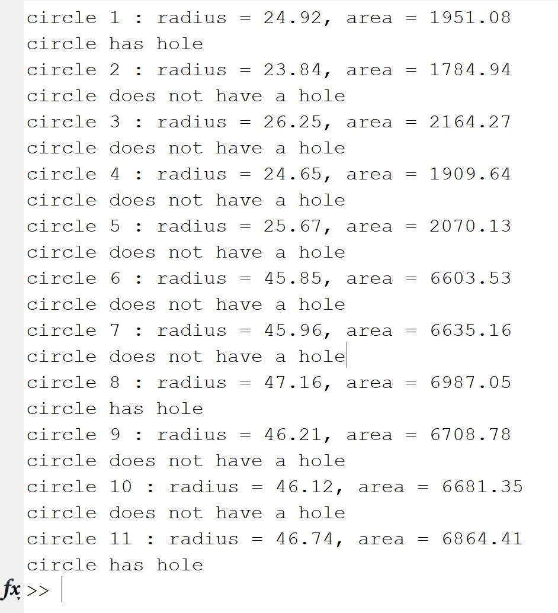
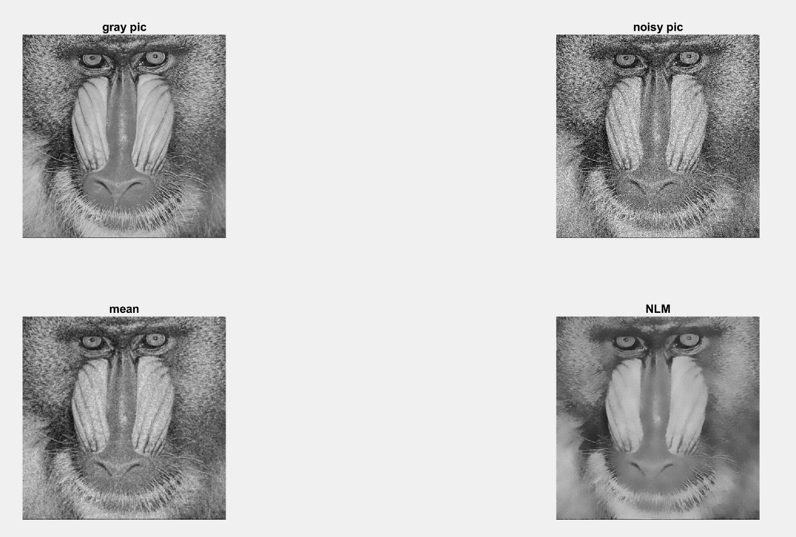
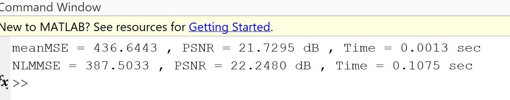
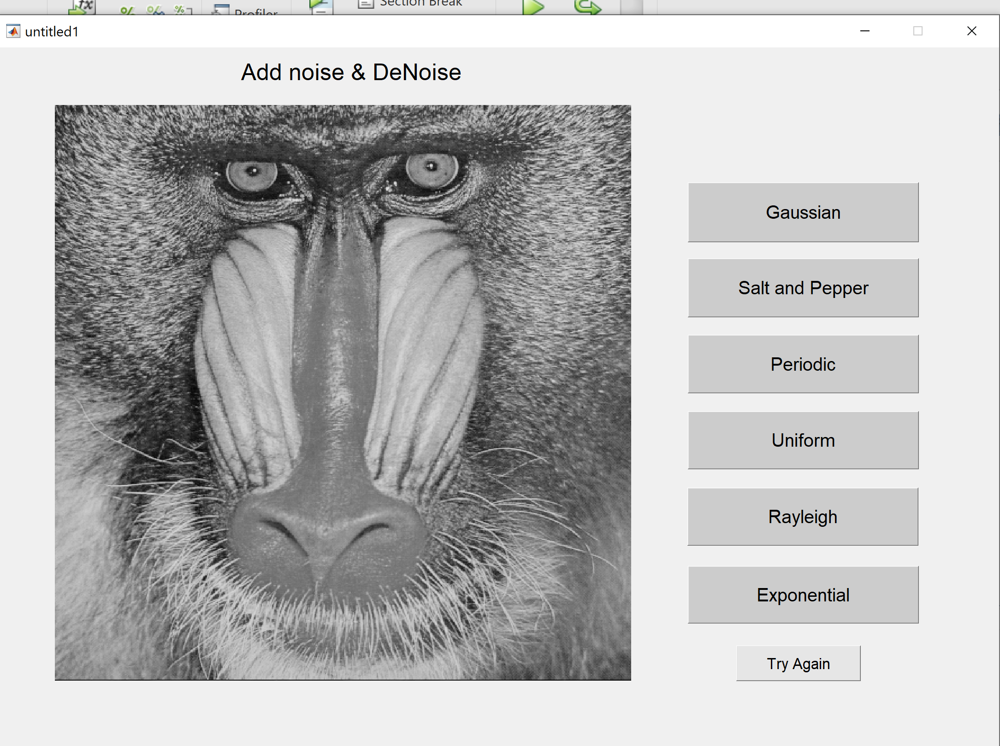
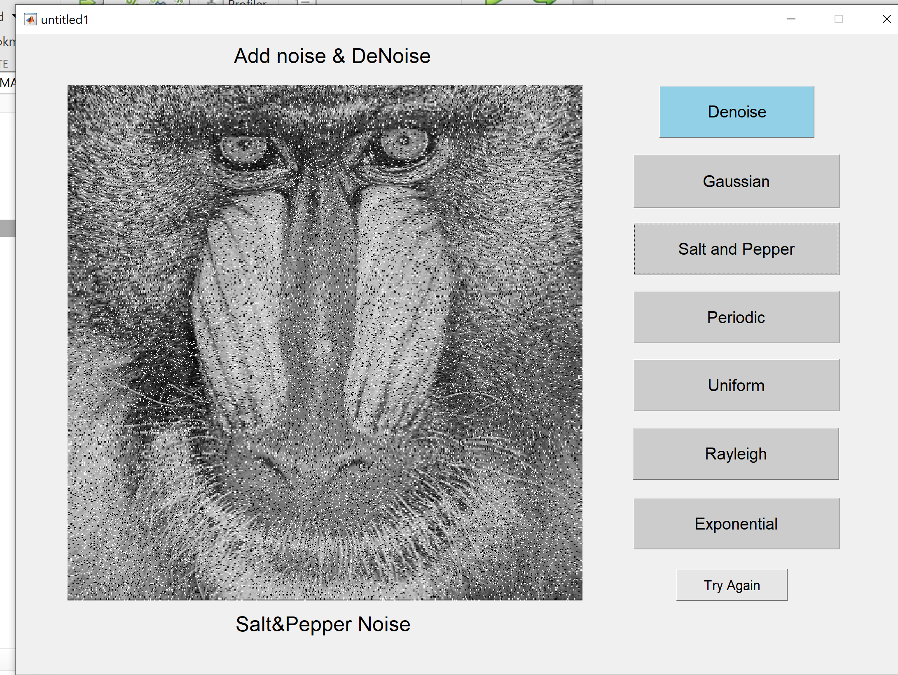
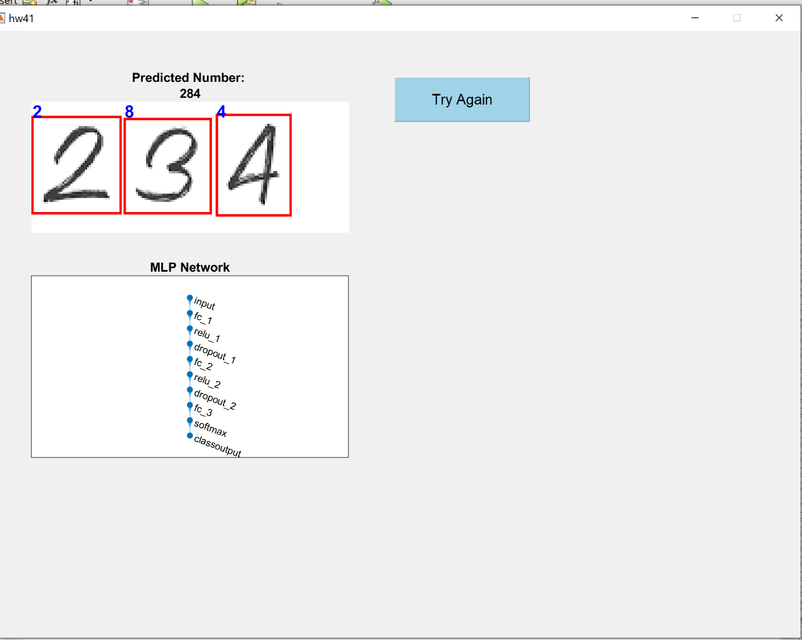

# Computer Vision Course

This repository contains homeworks and projects for my **Computer Vision** course at university. All implementations are done in **Python** and **MATLAB**.

## HW1: Image Processing Fundamentals

### Question 1: Circular Hough Transform

**Problem Statement:**  
Write a program that identifies the circular-shaped parts in the figures using the Circular Hough Transform. Then, calculate their area. If the shape has a hole, also identify it.

**Figure:**

**Output:**

### Question 2: Non-Local Means (NLM) Filter

**Problem Statement:**  
Convert the image `Baboon.jpg` to grayscale, and then corrupt it with Gaussian noise with zero mean and variance 5.

**Figure:**

**Output:**

### Question 3: Edge Detection Comparison (Canny vs. Sobel, Prewitt, Roberts)

**Problem Statement:**  
The Canny method is one of the best edge detectors. Compare the results of applying it with different parameters on the `camera256` image against Sobel, Prewitt, and Roberts.

**Figure:**

---

## HW2: Noise and Denoising

### Question 1: Noise Types and Denoising (GUI)

Apply six different types of noise to image image `Baboon.jpg` and then denoise it using a GUI.

1. Gaussian noise
2. Salt and pepper noise
3. Periodic noise
4. Rayleigh noise
5. Exponential noise
6. Uniform noise

**Figure:**

**Salt & Pepper Noise Applied:**

---

## HW3: MLP for Multi-Digit Recognition

### Question 1: MLP for Multi-Digit Number Recognition (GUI)

Design a GUI-based MLP for recognizing multi-digit numbers, where the MLP is trained only on single-digit numbers.

**Dataset:**  
The dataset used for training the MLP is the **Handwritten Digits 0-9** dataset from Kaggle: https://www.kaggle.com/datasets/olafkrastovski/handwritten-digits-0-9

**Recognition Output:**

---

## HW4: Traffic Sign Classification with ResNet-50

### Question 1: Traffic Sign Classification Using ResNet-50  
Classify images of traffic signs using the ResNet-50 architecture.

**Dataset:**  
The dataset used is the **Persian Traffic Sign Dataset (PTSD)** from Kaggle: https://www.kaggle.com/datasets/saraparsaseresht/persian-traffic-sign-dataset-ptsd

**Overall model accuracy on the test set:**

---
